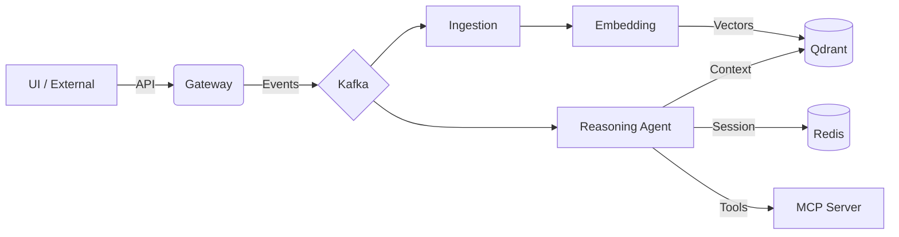

# Ai_Intelligence

[](https://opensource.org/licenses/MIT)
[](https://www.python.org/)
[](https://fastapi.tiangolo.com/)
[](https://docs.docker.com/compose/)
[](https://kubernetes.io/)

A state-of-the-art Real-Time AI Intelligence Platform designed for high scalability, autonomous reasoning, and event-driven processing.

## 🚀 Overview

The **Real-Time AI Intelligence Platform** is a distributed microservice architecture designed to handle high-volume event streams and provide autonomous reasoning via LLMs. It bridges the gap between raw data ingestion and intelligent action through a decoupled, event-driven mesh.

### Core Pillars
- **Distributed Intelligence**: Decoupled agents coordinating via Kafka.
- **Semantic Memory**: High-performance RAG using Qdrant vector space.
- **Tool Orchestration**: First-class support for the Model Context Protocol (MCP).
- **Enterprise Grade**: Built for Kubernetes with structured JSON logging and native health probes.

---

## 🛠 Tech Stack

| Layer | Technology |
|-------|------------|
| **Frontend** |  |
| **API Gateway** |  /  |
| **Event Bus** |  |
| **Vector DB** |  |
| **State/Cache** |  |
| **AI Models** | Google Gemini (Pro/Flash), Anthropic Claude (Sonnet/Haiku) |
| **Orchestration** |  /  |

---

## 🔱 Getting Started

### 1. Forking Instructions

To contribute or customize the platform, please follow these forking guidelines:

1.  **Fork the Repository**: Click the 'Fork' button at the top right of the GitHub page.
2.  **Clone your Fork**:
    ```bash
    git clone https://github.com/YOUR_USERNAME/Ai_Intelligence.git
    cd Ai_Intelligence
    ```
3.  **Configure Upstream Remotes**:
    ```bash
    git remote add upstream https://github.com/AmishhYadav/Ai_Intelligence.git
    ```
4.  **Syncing with Upstream**:
    ```bash
    git fetch upstream
    git checkout main
    git merge upstream/main
    ```

### 2. Local Setup (Quick Start)

The platform is fully containerized. To spin up the entire architecture:

1.  **Configure Environment**:
    ```bash
    cp ai-platform/.env.example ai-platform/.env
    # Edit .env with your Google Gemini / Anthropic API keys
    ```
2.  **Launch Services**:
    ```bash
    cd ai-platform
    docker-compose up --build -d
    ```
3.  **Access the Dashboard**: Open `http://localhost:8501` to access the Nova UI.

---

## 🏗 System Architecture

The platform follows a **Clean Architecture** pattern, separating the business logic (Agents/Reasoning) from the infrastructure (Kafka/Redis/Qdrant).



Detailed documentation for each component is available in the **[ai-platform/](file:///Users/amish/Ai_Intelligence/ai-platform)** directory.

---

## 📜 Coding Standards & Contributing

We maintain high code quality standards:
- **Linting**: All Python code must pass `flake8` or `ruff` linting.
- **Type Safety**: Strictly enforced type hints (`mypy`).
- **Commits**: Follow [Conventional Commits](https://www.conventionalcommits.org/en/v1.0.0/).

### How to Contribute
1. Create a feature branch (`git checkout -b feat/amazing-feature`).
2. Commit your changes.
3. Push to the branch (`git push origin feat/amazing-feature`).
4. Open a Pull Request.

---

## 🔒 Security & Privacy

- **Data Encryption**: All PII is encrypted at rest in Redis/Qdrant.
- **Authentication**: JWT-based stateless authentication at the Gateway level.
- **Reporting Vulnerabilities**: Please email `security@example.com` for vulnerability reports.

---

## 📄 License

This project is licensed under the MIT License - see the [LICENSE](LICENSE) file for details.

---
Built with ❤️ for the future of Autonomous Intelligence.
