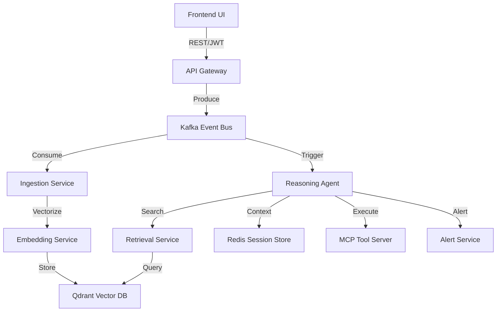

# Real-Time AI Intelligence Platform

A Cloud-Native, Event-Driven AI Platform designed for high scalability, real-time streaming, and autonomous reasoning. This is not a monolith; it is a distributed microservice architecture heavily adhering to Clean Architecture principles, 12-factor app guidelines, and the Model Context Protocol (MCP).

## 🛠 Tech Stack

| Component          | Technology                                                                                                                                      |
|--------------------|---------------------------------------------------------------------------------------------------------------------------------------------------|
| **Frontend**       |                                       |
| **API Gateway**    |   |
| **Event Bus**      |                                                |
| **Vector DB**      |                                                                            |
| **State/Cache**    |                                            |
| **AI Models**      | Google Gemini, Anthropic Claude                                                                                                                 |
| **Protocols**      | Model Context Protocol (MCP), JWT, gRPC (internal)                                                                                              |
| **Infrastructure** |   |

## 🏗 Architecture Map



## 🛰 Event-Driven Architecture (EDA)

The platform utilizes a decoupled EDA to ensure high availability and non-blocking inference.

### Kafka Topic Schema
| Topic | Producer | Consumer(s) | Payload Type | Description |
|-------|----------|-------------|--------------|-------------|
| `user_events` | API Gateway | Ingestion Service | JSON | Raw user queries and metadata. |
| `ingestion_events`| Ingestion | Embedding Worker | JSON | Chunked text for vectorization. |
| `reasoning_tasks` | Ingestion | Reasoning Agent | JSON | Orchestration tasks for LLMs. |
| `alerts` | Agent | Alert Service | JSON | Critical system or LLM alerts. |

---

## ⚙️ Configuration Matrix (.env)

| Variable | Required | Default | Description |
|----------|----------|---------|-------------|
| `GOOGLE_API_KEY` | Yes | - | API Key for Gemini Pro/Flash models. |
| `ANTHROPIC_API_KEY`| No | - | API Key for Claude models (optional). |
| `KAFKA_BOOTSTRAP_SERVERS` | Yes | `kafka:9092` | List of Kafka brokers. |
| `REDIS_URL` | Yes | `redis://redis:6379/0` | Connection string for session state. |
| `QDRANT_URL` | Yes | `http://qdrant:6333` | Vector database endpoint. |
| `JWT_SECRET_KEY` | Yes | - | Secret key for signing Auth tokens. |

---

## 🏗 Microservices Deep-Dive

- **`api_gateway`**: Built with FastAPI. Handles SSL termination (at ingress), JWT validation, and rate limiting via Redis. It publishes to the `user_events` topic.
- **`ingestion_service`**: The traffic controller. It uses asynchronous workers to split large documents and route them as either embedding jobs or reasoning tasks.
- **`embedding_service`**: Scales horizontally. It calls Gemini/Claude embedding endpoints and upserts vectors into Qdrant.
- **`retrieval_service`**: Exposes a clean API for the Reasoning Agent to perform hybrid search (vector + scalar filters) on Qdrant.
- **`agent_service`**: The "brain". Implements a ReAct loop. It maintains multi-turn conversation memory in Redis and executes tools via the MCP Server.
- **`mcp_server`**: A modular tool server implementing the Model Context Protocol. Easily extensible via standard JSON-RPC.
- **`alert_service`**: Monitors the `alerts` Kafka topic and dispatches notifications via webhooks/Slack.

---

## 🧪 Testing & Quality Assurance

### 1. Automated Testing Suites
- **Unit Tests**: Coverage for individual service logic.
  ```bash
  pytest services/agent_service/tests
  ```
- **Integration Tests**: Validating Kafka message flow between services.
  ```bash
  pytest tests/integration
  ```
- **Load Testing**: Using Locust/Custom scripts to simulate concurrent sessions.
  ```bash
  python scripts/load_test.py --users 100 --spawn-rate 10
  ```

### 2. CI/CD Integration
The project includes a `.github/workflows` pipeline (if present) that runs the following on every PR:
- `flake8 / black` formatting checks.
- `mypy` static type analysis.
- Full test suite execution in a Dockerized environment.

---

## 📊 Observability & Monitoring

- **Structured Logging**: Every service emits JSON logs (via `JSONFormatter`) for easy ingestion into ELK/Prometheus.
- **Health Probes**: `/health` endpoints return detailed component status (e.g., Kafka connection state, DB latency).
- **Traces**: (Planned) OpenTelemetry integration for end-to-end request tracing.

---

## 🚀 Setup & Deployment

### Local Development
```bash
docker-compose up --build -d
```

### Kubernetes (Production)
```bash
kubectl apply -f infra/k8s/
```
*Note: Refer to the `infra/` directory for Helm charts and specialized K8s manifests.*
