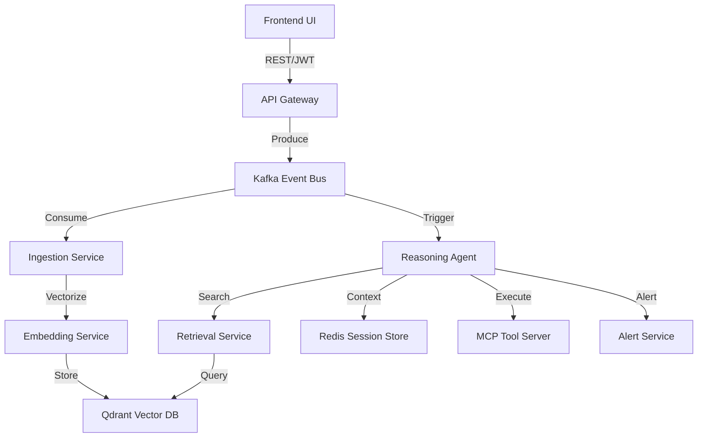

# Real-Time AI Intelligence Platform

A Cloud-Native, Event-Driven AI Platform designed for high scalability, real-time streaming, and autonomous reasoning. This is not a monolith; it is a distributed microservice architecture heavily adhering to Clean Architecture principles, 12-factor app guidelines, and the Model Context Protocol (MCP).

## 🛠 Tech Stack

| Component          | Technology                                                                                                                                      |
|--------------------|---------------------------------------------------------------------------------------------------------------------------------------------------|
| **Frontend**       |                                       |
| **API Gateway**    |   |
| **Event Bus**      |                                                |
| **Vector DB**      |                                                                            |
| **State/Cache**    |                                            |
| **AI Models**      | Google Gemini, Anthropic Claude                                                                                                                 |
| **Protocols**      | Model Context Protocol (MCP), JWT, gRPC (internal)                                                                                              |
| **Infrastructure** |   |

## 🏗 Architecture Map



## Infrastructure Map

```text
API Gateway --> (Publishes) -> [Kafka] -> (Consumes) -> Event Ingestion
Event Ingestion -> (Publishes) -> [Kafka] -> (Consumes) -> Embedding Worker
Event Ingestion -> (Publishes) -> [Kafka] -> (Consumes) -> Reasoning Agent
Reasoning Agent <--> Redis (Session State)
Reasoning Agent <--> Retrieval Service <--> Qdrant DB
Reasoning Agent <--> MCP Tool Server
Reasoning Agent -> (Publishes) -> [Kafka] -> (Consumes) -> Alert Service
```

## Setup & Deployment (Local)

1. Clone the repository.
2. Provide your API keys in the `.env` file (see `.env.example`).
3. Run the complete architecture using Docker Compose:
    ```bash
    docker-compose up --build -d
    ```
4. Verify Health checks: `http://localhost:8000/health`
5. Test Load via Simulation script:
    ```bash
    python scripts/load_test.py
    ```

## Setup & Deployment (Kubernetes - Minikube)

1. Start minikube: `minikube start`
2. Create namespace: `kubectl create namespace ai-platform`
3. Apply ConfigMaps and Secrets: `kubectl apply -f infra/k8s/config.yaml`
4. Deploy the API Gateway: `kubectl apply -f infra/k8s/api-gateway.yaml`
    * Note: You must build and load the docker image into minikube first or use a registry. `minikube image load ai-platform/api-gateway:latest`
    * You can replicate the deployment pattern for the other 6 microservices easily using the gateway helm/yaml standard shown.

## Microservices Breakdown
- `api_gateway`: Ingress FastAPI layer handling Authentication (JWT) and Rate limiting (Redis).
- `ingestion_service`: Event router splitting monolithic inputs into Vectorization jobs and reasoning tasks.
- `embedding_service`: Worker bridging unstructured text to Qdrant vector space via Google Gemini.
- `retrieval_service`: Private network service exposing Hybrid Vector Search abstractions.
- `agent_service`: Core intelligent hub coordinating Memory, Vector Context, Tool Execution, and final reasoning.
- `mcp_server`: Modular Function-Calling endpoint enforcing the Model Context Protocol schema logic.
- `alert_service`: Egress webhook dispatcher logging simulated CRITICAL risk events.

## Observability
- All files use a `JSONFormatter` guaranteeing structured JSON logging across the architecture.
- Health Probes (`/health`) natively integrated across threaded async Kafka consumers and standard FastAPIs. 
